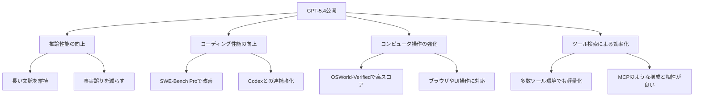
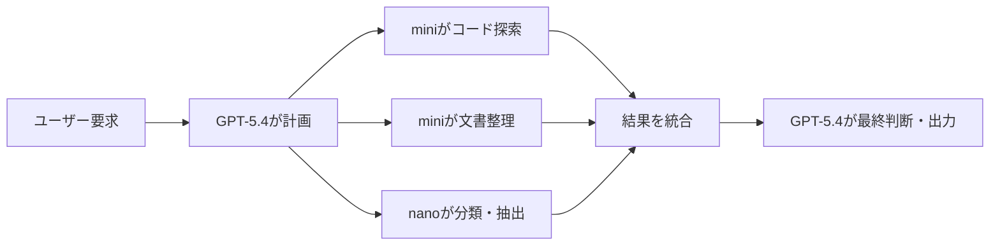

*Image source: OpenAI 「Introducing GPT-5.4」*

📌 **3行でわかるこの記事**
- OpenAIは2026年3月、GPT-5.4をChatGPT・API・Codexで公開し、あわせてGPT-5.4 Pro、mini、nanoも展開しました。
- 今回の要点は、単なるベンチマーク更新ではなく、**推論・コーディング・エージェント実行・コンピュータ操作**を1つの流れで強化した点です。
- 開発者にとっては「高性能モデルをどう使うか」だけでなく、**大モデル + 小モデル + ツール検索**という設計パターンが現実的になったニュースでもあります。

---

## なぜこの発表が重要なのか

2026年3月のAIニュースで特に重要だったのが、OpenAIの**GPT-5.4公開**です。

生成AIの新モデル発表は珍しくありませんが、今回のアップデートは少し毛色が違います。OpenAIはGPT-5.4を、単に「前モデルより賢いモデル」としてではなく、**現実の仕事を最後まで進めるための中核モデル**として位置づけています。

実際、OpenAIの発表では次の4点が繰り返し強調されています。

### GPT-5.4で強化された4つの軸

- 推論性能
- コーディング性能
- ツール利用とエージェント性能
- コンピュータ操作能力

この4つが揃うと、チャットで答えるだけのAIから、**調べる・計画する・実行する・確認する**AIへ一段進みます。

## GPT-5.4の要点

### OpenAIが発表した内容

OpenAIによると、GPT-5.4は以下で提供されています。

- ChatGPT（GPT-5.4 Thinking / GPT-5.4 Pro）
- API（`gpt-5.4`, `gpt-5.4-pro`）
- Codex

さらに同日に、軽量モデルとして**GPT-5.4 mini / nano**も発表されました。

### 何がアップデートされたのか

発表文の内容を整理すると、今回の変化は次のようにまとめられます。



## ベンチマークから見える実力

### 1. 知識労働タスクでの改善

OpenAIは、44職種の知識労働タスクを評価する**GDPval**で、GPT-5.4が**83.0%**を記録し、GPT-5.2の**70.9%**を上回ったと説明しています。

ここで面白いのは、単なるQAではなく、次のような「仕事の成果物」に近い課題が評価対象になっている点です。

- 営業資料
- 会計スプレッドシート
- スケジュール作成
- 製造図面
- 短い動画

つまり、GPT-5.4は「正答率」よりも、**実務で使えるアウトプットをどれだけ安定して出せるか**で勝負していると言えます。

### 2. コーディングとエージェント性能

OpenAIの発表では、GPT-5.4は**SWE-Bench Pro 57.7%**、**Toolathlon 54.6%**、**BrowseComp 82.7%**などの数値が示されています。

特に重要なのは、モデル単体の推論性能だけでなく、**ツールを使った複数ステップの作業**で改善している点です。

#### どういう仕事に効くのか

- コードベースをまたいだ修正
- Web調査を伴う実装
- ドキュメント・表計算・プレゼンの横断処理
- 長めのワークフローを途中で破綻させず進める作業

### 3. コンピュータ操作の進化

OpenAIはGPT-5.4を、**初の汎用モデルとしてネイティブなcomputer-use能力を持つ**と説明しています。

具体的には、次のような記述がありました。

- OSWorld-Verifiedで**75.0%**
- WebArena-Verifiedで**67.3%**
- Online-Mind2Webで**92.8%**

これは、AIが「画面を見て理解する」だけでなく、**スクリーンショットやUI文脈をもとに操作を継続できる**方向に進んでいることを示します。

#### ここで効いてくるのは何か

- E2Eテスト自動化
- 業務システムの半自動操作
- ブラウザを跨いだ情報取得
- GUI前提のレガシーツール操作

## mini / nano が示すもう一つの変化

GPT-5.4本体と同じくらい重要なのが、**GPT-5.4 mini / nano**の登場です。

OpenAIによると、GPT-5.4 miniはGPT-5 miniより**2倍以上高速**で、SWE-Bench ProやOSWorld-Verifiedでも大きく改善しています。nanoはさらに安価で、分類・抽出・ランキング・軽いコーディング補助向けとされています。

### これが意味する設計の変化

大モデル1個ですべてをやる発想から、次の構成が現実的になってきました。



この形は、単にコストを下げるだけではありません。**速い小モデルに細かい作業を分担させる**ことで、全体の応答速度と運用効率を改善できます。

### ツール検索も地味に大きい

OpenAIは同時に、GPT-5.4で**tool search**を導入したと説明しています。多数のツール定義を最初から全部プロンプトに詰め込むのではなく、必要になった時点で参照する方式です。

発表では、36個のMCPサーバーを有効にした評価で、**精度を維持したまま総トークン使用量を47%削減**したとされています。

#### 開発者目線でのインパクト

- ツールが多い環境でも文脈が圧迫されにくい
- レイテンシとコストを抑えやすい
- MCP的な大規模ツール接続との相性が良い

## 実務ではどう使い分けるべきか

### まず結論

GPT-5.4関連の今回の発表は、次のように使い分けると理解しやすいです。

#### GPT-5.4

- 複雑な判断
- 長いタスク
- コーディング + ツール利用 + 統合作業

#### GPT-5.4 mini

- 高速なサブタスク
- コード探索
- UI理解を伴う軽量処理

#### GPT-5.4 nano

- 分類
- データ抽出
- ランキング
- 安価な補助処理

### API設計イメージ

以下のような構成は、かなり現実的です。

#### オーケストレーション例

```bash
# 親モデルが計画を立て、小モデルへ委譲するイメージ
curl https://api.openai.com/v1/responses \
  -H "Authorization: Bearer $OPENAI_API_KEY" \
  -H "Content-Type: application/json" \
  -d '{
    "model": "gpt-5.4",
    "input": "大きなタスクを分解し、必要なら mini / nano へ委譲する"
  }'
```

上のコードは概念例ですが、今回の発表以降はこの「**大モデルが計画し、小モデルが処理する**」構図がかなり自然になりました。

## 旧モデル整理の発表も見逃せない

OpenAIは別記事で、ChatGPTにおける**GPT-4o、GPT-4.1、GPT-4.1 mini、o4-miniの終了予定**も告知しています。

これは単なる整理ではなく、OpenAIが今後の中心を**GPT-5系へ一本化**していくシグナルと見てよさそうです。

### 業界全体への示唆

- モデル数を増やすより、主力系統を磨く流れ
- 「会話らしさ」よりも「仕事の完遂力」を重視
- ただし軽量モデルはむしろ増え、役割分担が明確になる

## まとめ

今回のGPT-5.4公開は、性能更新以上に**AIシステムの設計思想が1段進んだ**ニュースでした。

### ポイントを振り返ると

- GPT-5.4は推論・コーディング・コンピュータ操作・ツール利用を横断的に強化
- GPT-5.4 mini / nano によって、役割分担型の実装がしやすくなった
- tool search により、多数ツール環境での実運用が現実的になった
- 旧モデル整理も含め、OpenAIはGPT-5系への集約を進めている

2025年までの「どのモデルが一番賢いか」という競争から、2026年は「**どの構成が一番仕事を終わらせられるか**」という競争に移ってきた。そんな空気を感じる発表でした。

## 参考リンク

1. [Introducing GPT-5.4 | OpenAI](https://openai.com/index/introducing-gpt-5-4/)
2. [Introducing GPT-5.4 mini and nano | OpenAI](https://openai.com/index/introducing-gpt-5-4-mini-and-nano/)
3. [Retiring GPT-4o, GPT-4.1, GPT-4.1 mini, and OpenAI o4-mini in ChatGPT | OpenAI](https://openai.com/index/retiring-gpt-4o-and-older-models/)
4. [OpenAI API docs: latest model guide](https://developers.openai.com/api/docs/guides/latest-model)
