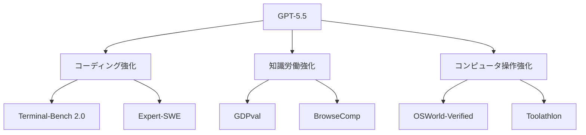

*出典: OpenAI "Introducing GPT-5.5"*

## 📌 3行でわかるこの記事

- OpenAIが2026年4月23日に **GPT-5.5** を発表し、コーディング・知識労働・コンピュータ操作の強化を前面に出しました。
- 公式情報では、GPT-5.4比で **Terminal-Bench 2.0: 82.7%→75.1%、OSWorld-Verified: 78.7%→75.0%** など、実務寄り指標の改善が示されています。
- 今回のポイントは「より賢い会話AI」ではなく、**曖昧な仕事を受けて、計画し、ツールを使い、最後まで進めるAI** に寄せてきたことです。

---

## はじめに

2026年4月23日、OpenAIは **GPT-5.5** を公開しました。

今回の発表を見てまず感じたのは、性能の見せ方がかなり変わってきたことです。単に「ベンチマークで強い」ではなく、

- コードを書ける
- ツールを使える
- コンピュータ上の作業を進められる
- 長い仕事を途中で投げにくい

といった、**実務でそのまま効く能力**が前面に出ています。

この記事では、OpenAIの公式発表とSystem Cardをもとに、GPT-5.5の何が新しく、どこが重要なのかを整理します。

## 何が発表されたのか

### GPT-5.5はどんなモデルか

OpenAI公式ブログでは、GPT-5.5を「最も賢く、最も直感的に使えるモデル」と位置付けています。

特に強調されていたのは次の点です。

#### 公式発表で強調された能力

- 書く・調べる・分析する・資料化する、といった知識労働
- コード実装、デバッグ、検証
- ソフトウェアやツールをまたいだ長めの作業
- 曖昧な依頼を受けて、必要な段取りを自分で組み立てること

### ロールアウト状況

OpenAIによると、2026年4月23日時点で以下の形で展開されています。

#### 利用提供

- ChatGPT: Plus / Pro / Business / Enterprise に順次展開
- Codex: GPT-5.5 を提供
- GPT-5.5 Pro: Pro / Business / Enterprise 向けに展開
- API: 近いうちに提供予定と案内

## 数字で見るGPT-5.5

### 主要ベンチマーク

公式記事で示された代表値を抜き出すと、次のようになります。

#### GPT-5.5 と GPT-5.4 の比較

- **Terminal-Bench 2.0**: 82.7% vs 75.1%
- **Expert-SWE (Internal)**: 73.1% vs 68.5%
- **GDPval (wins or ties)**: 84.9% vs 83.0%
- **OSWorld-Verified**: 78.7% vs 75.0%
- **Toolathlon**: 55.6% vs 54.6%
- **BrowseComp**: 84.4% vs 82.7%
- **FrontierMath Tier 4**: 35.4% vs 27.1%
- **CyberGym**: 81.8% vs 79.0%

### どの数字が特に重要か

個人的に注目すべきは、単純なQA系よりも次の3つです。

#### 1. Terminal-Bench 2.0

コマンドライン上での複雑なワークフローをどれだけこなせるかを見る指標です。ここでの改善は、**長いエージェント的作業**への強さを示しています。

#### 2. OSWorld-Verified

実際のコンピュータ環境をどれだけ操作できるかの評価です。ここが伸びているのは、GUIやツール操作を含む「仕事の実行」能力が上がっていることを示唆します。

#### 3. GDPval

44職種にまたがる知識労働タスクを扱う評価で、単なる回答精度ではなく、**実務成果物の質**に寄った見方ができます。



## なぜ今回の発表が重要なのか

### 会話AIから実行AIへ軸足が移っている

GPT-5.5の説明文を読むと、OpenAIはもはや「質問に答えるAI」を中心には語っていません。

代わりに出てくるのは、

- 計画する
- ツールを使う
- 状況を確認する
- 必要ならやり直す
- 終わるまで継続する

という流れです。

これはかなり重要です。なぜなら、現場で価値が出るのは一問一答よりも、**途中工程を持つ仕事**だからです。

### 実際に想定されるユースケース

#### 開発現場

- バグ修正
- リファクタリング
- テスト追加
- 既存コードベースをまたいだ修正

#### ビジネス現場

- 情報収集からレポート化
- スプレッドシート整理
- 定型資料の作成
- 社内業務フローの半自動化

#### 研究・分析

- データ確認
- 仮説整理
- 解析メモの下書き
- 技術調査の反復


## System Cardから見える安全面

### OpenAIは安全評価もかなり前面に出している

GPT-5.5 System Cardでは、OpenAIが以下を実施したと説明しています。

#### 安全面の要点

- フルスイートの事前安全評価
- Preparedness Frameworkに沿った確認
- 高度なサイバー・バイオ領域のレッドチーミング
- 約200の早期アクセスパートナーからのフィードバック反映

ここで重要なのは、GPT-5.5が単に高性能なだけでなく、**高性能化した結果として起こりうるリスク**も意識して展開されていることです。

### 実務上の意味

#### 導入時に見るべき観点

- どこまで自律的に動かせるか
- どこに人間の承認を挟むべきか
- サイバー領域での誤用や逸脱をどう抑えるか
- 監査ログや利用制御をどう設計するか

## 開発者目線での読み解き

### これから効くのは「モデル性能」単体ではない

GPT-5.5の発表は派手ですが、本質はそれだけではありません。

むしろ開発者にとって大きいのは、**モデル単体の精度より、仕事全体の完遂率をどう上げるか**という流れが強まっていることです。

#### 重要になる設計ポイント

- 適切なツール接続
- 途中結果の検証
- リトライ戦略
- 長い文脈の保持
- 承認フロー
- 安全ガードレール

### ざっくり実装イメージ

たとえば、業務エージェントを組むなら発想はこうなります。

```python
request = receive_task()
plan = model.plan(request)

while not plan.done:
    tool_result = run_tool(plan.next_action)
    plan = model.review_and_update(tool_result)

final_output = model.summarize(plan)
return final_output
```

このループを安定して回せるかどうかが、今後の差になりそうです。

## 今回の発表から見える3つの示唆

### 1. AIは「答えるもの」より「進めるもの」になる

#### 受け身の応答から、作業主体へ

GPT-5.5の説明は、会話品質だけでなく、**タスクを前に進める力**に比重があります。

#### つまり何が変わるか

- プロンプト職人芸の価値が相対的に下がる
- タスク設計と権限設計の価値が上がる
- 1回の返答品質より、ジョブ完遂率が重要になる

### 2. コーディング支援はさらに自律化へ進む

#### IDE補完の延長ではなくなる

Terminal-BenchやExpert-SWEを前面に出している時点で、OpenAIは補完より**実装代行に近い価値**を狙っています。

#### 開発現場への影響

- 小さい修正だけでなく中規模タスクも任せやすくなる
- テストや検証まで含めた委譲が進む
- 人間はレビューと方向付けに寄りやすくなる

### 3. 安全性は製品の付属品ではなく本体機能になる

#### 高性能モデルほど安全設計が重要

能力が上がるほど、誤作動や誤用のコストも上がります。

#### 導入側が準備すべきこと

- 利用範囲の明確化
- 監査可能な実行ログ
- 権限の最小化
- 人間レビューの挿入点設計

## まとめ

GPT-5.5は、単なる性能更新以上の意味を持つ発表でした。

### まとめると

- OpenAIはGPT-5.5で、**コーディング・知識労働・コンピュータ操作**をまとめて強化した
- 指標の見せ方も、会話能力より**実務完遂力**へ寄っている
- 今後はモデル比較だけでなく、**エージェント設計・安全設計・業務組み込み**が本当の勝負になる

個人的には、今回の発表は「AIが賢くなった」というより、**AIを仕事の実行レイヤーに置く準備が整ってきた**というニュースとして読むのがしっくりきます。

## 参考リンク

1. [Introducing GPT-5.5 | OpenAI](https://openai.com/index/introducing-gpt-5-5/)
2. [GPT-5.5 System Card | OpenAI](https://openai.com/index/gpt-5-5-system-card/)
3. [OpenAI News](https://openai.com/news/)
4. [Artificial Analysis Intelligence Benchmarking Methodology](https://artificialanalysis.ai/methodology/intelligence-benchmarking)
