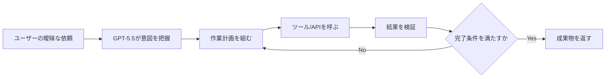
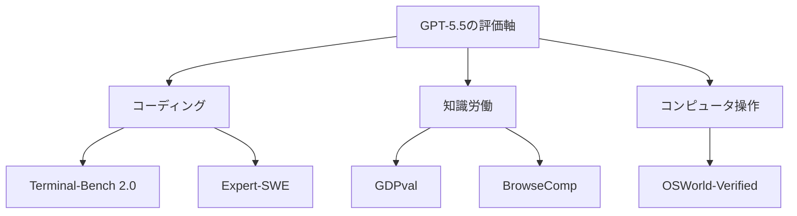

*出典: OpenAI "Introducing GPT-5.5"*

## 📌 3行でわかるこの記事

- OpenAIは2026年4月24日の更新で、**GPT-5.5 / GPT-5.5 Pro のAPI提供開始**を案内しました。
- GPT-5.5は、単なる対話性能よりも **コーディング・ツール利用・知識労働の完遂力** を前面に出したモデルです。
- 今回の見どころは性能向上そのものより、**「答えるAI」から「作業を進めるAI」へ製品の重心が移ったこと**です。

---

## はじめに

OpenAIの「Introducing GPT-5.5」は4月23日の公開時点でも十分に大きなニュースでしたが、4月24日の更新で意味合いが一段深くなりました。

更新内容はシンプルです。**GPT-5.5とGPT-5.5 ProがAPIでも利用可能になった**、という点です。

これは単なる提供面の拡大ではありません。ChatGPTやCodexの中で強いモデルが、いよいよ外部システムや業務フローの中に組み込める段階に入った、ということでもあります。

## 4月24日の更新ポイント

### 何が変わったのか

OpenAI公式ページの更新文には、次のように書かれています。

#### 公式更新の要旨

- 2026年4月24日付で **GPT-5.5 / GPT-5.5 Pro がAPIで利用可能**
- System Cardも更新され、**API展開時に適用される追加の安全策**が追記
- ローンチ直後の「ChatGPT/Codex中心の提供」から、**開発者実装フェーズ**へ進んだ

### なぜ重要か

モデルの本当のインパクトは、チャット画面で賢いことより、**既存のアプリや社内ツールに接続できること**で決まります。

今回のAPI展開で、GPT-5.5は次のような使い方に直結しやすくなりました。

#### 実装に落とし込みやすい用途

- 調査→整理→レポート生成の自動化
- コード修正→テスト→検証の反復
- 社内オペレーションの半自動化
- 複数ツールをまたぐエージェント型ワークフロー



## GPT-5.5は何が強いのか

### OpenAIが前面に出したのは「実行力」

公式記事では、GPT-5.5を「最も賢く、最も直感的に使えるモデル」と説明しつつ、特に以下を強調しています。

#### 公式に示された強み

- コードの作成とデバッグ
- オンライン調査
- 情報分析
- 文書・スプレッドシート作成
- ツールを横断した長めの作業継続

ここで面白いのは、説明の軸が「会話が自然」ではなく、**仕事を最後まで進められるか**にあることです。

### ベンチマークでも傾向は同じ

公式記事では、GPT-5.4比で次のような改善が示されています。

#### 代表的な比較値

- **Terminal-Bench 2.0**: 82.7%（GPT-5.4は75.1%）
- **Expert-SWE (Internal)**: 73.1%（同68.5%）
- **GDPval (wins or ties)**: 84.9%（同83.0%）
- **OSWorld-Verified**: 78.7%（同75.0%）
- **BrowseComp**: 84.4%（同82.7%）

この顔ぶれを見ると、OpenAIが重視しているのは一問一答ではなく、**長めの作業・ツール利用・知識労働の質**だと分かります。



## API展開で何が変わるのか

### これで「プロダクトに組み込む話」になる

ChatGPT上で強い、はもう珍しくありません。APIが出ると、話は一気に現実寄りになります。

#### 開発者にとっての変化

- PoCではなく本番組み込みを検討しやすい
- ワークフロー設計と権限設計が重要になる
- モデル単体性能より**完遂率**のチューニングが差になる

### 実装イメージ

たとえば、エージェント的な処理系はかなり素直に設計できます。

```python
request = receive_task()
plan = model.plan(request)

while not plan.done:
    action = plan.next_action
    result = run_tool(action)
    plan = model.review(result)

return model.finalize(plan)
```

このループを安定して回すには、モデルの賢さだけでなく、

#### 周辺設計で重要なもの

- ツール権限の最小化
- 途中結果の検証
- リトライ条件の定義
- 人間承認の挿入点
- 実行ログの保存

が必要です。

## 安全面で見るべき点

### System Card更新は地味ですが重要です

GPT-5.5 System Cardには、4月24日更新で **API deployment向けの追加情報** を含めたと明記されています。

またOpenAIは、GPT-5.5について次を説明しています。

#### 安全面の事実ベース整理

- フルスイートの事前安全評価を実施
- Preparedness Frameworkで評価
- 高度サイバー／バイオ領域のレッドチーミングを実施
- 約200の早期アクセスパートナーから実運用フィードバックを収集

### 実務上の含意

性能が高いモデルほど、事故ると被害も大きくなります。なので、導入側は「賢いから使う」だけでは足りません。

#### 導入時に確認したい観点

- どこまで自律実行させるか
- APIキーや社内データにどう触れさせるか
- 高リスク操作に承認を入れるか
- 出力ではなく**行動ログ**を残せるか

## 私の見立て

### GPT-5.5の本質は性能差そのものではない

正直、ベンチマーク差だけなら驚きは薄れてきています。いま本当に重要なのは、モデルが一段賢くなったことより、**OpenAI自身がAIを「実行レイヤー」として売り始めていること**です。

つまり競争軸は、

#### これからの勝負どころ

- どのモデルが一番賢いか
- どの環境で一番安全に動かせるか
- どの業務に一番自然に埋め込めるか
- どこまで人の手戻りを減らせるか

に移っています。

GPT-5.5のAPI展開は、その流れをかなりはっきり示した更新でした。

## まとめ

### 要点の整理

- OpenAIは4月24日更新で **GPT-5.5 / GPT-5.5 Pro のAPI提供開始**を案内
- GPT-5.5は、コーディング・知識労働・ツール利用を束ねた **実行寄りモデル** として位置付けられている
- 導入の価値は、会話品質より **業務完遂率と安全設計** に出やすい

今後は「どのモデルを使うか」よりも、「どの仕事を、どの権限で、どう完遂させるか」が実装の本題になりそうです。

## 参考リンク

1. [Introducing GPT-5.5 | OpenAI](https://openai.com/index/introducing-gpt-5-5/)
2. [GPT-5.5 System Card | OpenAI](https://openai.com/index/gpt-5-5-system-card/)
3. [Artificial Analysis Intelligence Benchmarking](https://artificialanalysis.ai/methodology/intelligence-benchmarking)
4. [OpenAI News](https://openai.com/news/)
