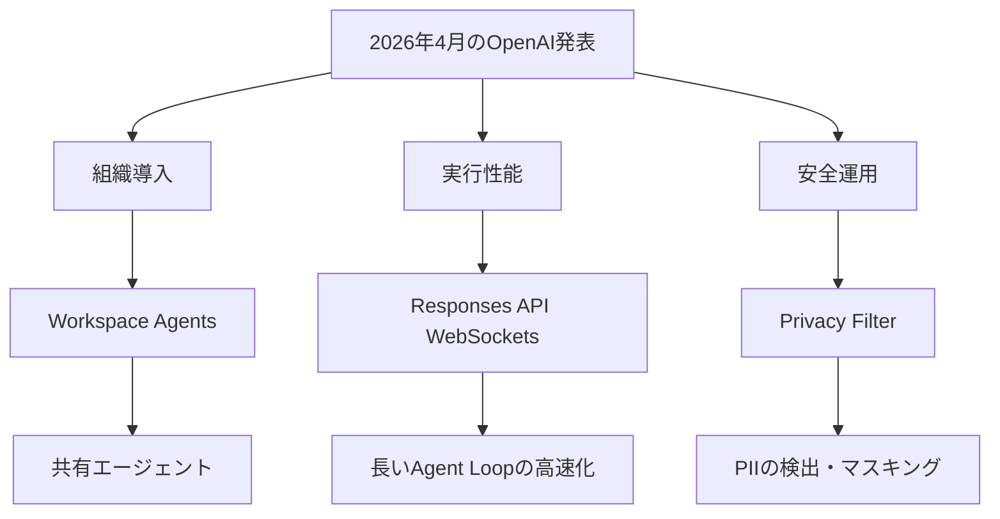
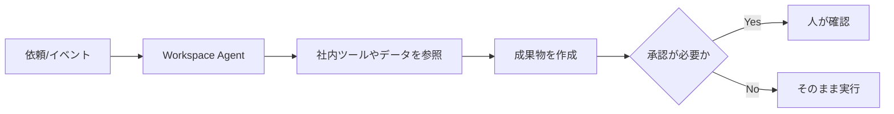
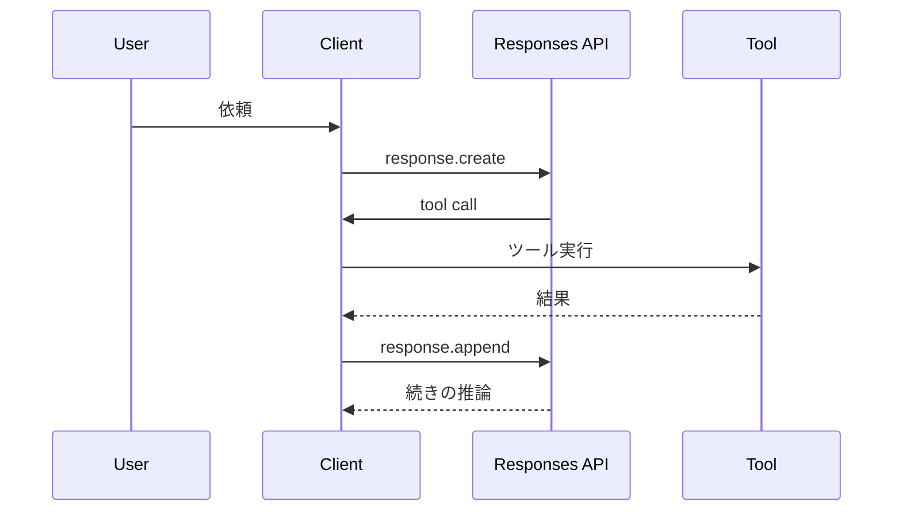

*Image source: OpenAI 「Introducing workspace agents in ChatGPT」*

📌 **3行でわかるこの記事**
- OpenAIは2026年4月後半、**Workspace Agents**、**Responses APIのWebSocket対応**、**Privacy Filter**を立て続けに公開しました。
- 3本を並べると、焦点はモデル単体の賢さではなく、**組織導入・高速実行・安全運用**の3点に移っています。
- 開発者目線では、これから重要なのは「何が作れるか」だけでなく、**どれだけ実務フローへ自然に入れられるか**です。

---

## はじめに

ここ数日のOpenAI発表を見ていると、単なる新モデルの話ではなくなってきたと感じます。

目立つのは次の3方向です。

- チームで共有できるエージェント
- エージェント実行を速くするAPI基盤
- 本番運用で避けて通れない個人情報保護

今回は、2026年4月22日前後に公開された3本をまとめて整理します。

### 取り上げるニュース

- **Introducing workspace agents in ChatGPT**（2026-04-22）
- **Speeding up agentic workflows with WebSockets in the Responses API**（2026-04-22）
- **Introducing OpenAI Privacy Filter**（2026-04-22）



## 1. Workspace Agentsは「個人用AI」から「チーム運用AI」へ進める


*Image source: OpenAI 「Introducing workspace agents in ChatGPT」*

### 何が発表されたのか

OpenAIはChatGPT内で、**共有可能なworkspace agents**を作れる機能を発表しました。公式説明では、これらのエージェントは**Codexを基盤**にし、複雑なタスクや長時間ワークフローをクラウド上で処理できます。

### 公式発表の要点

#### できること
- レポート作成
- コード作成
- メッセージ返信の下書き
- Slack上での利用
- スケジュール実行
- チーム共有と改善

#### 管理面で強調されていたこと
- 組織ごとの**権限・承認フロー**を設定可能
- 管理者向けの**監視・可視化**あり
- Compliance APIで構成や実行状況を追跡可能
- prompt injection対策などの安全策を組み込み

### 何が重要なのか

ここで大事なのは、GPTsの延長というより、**社内ワークフローの部品としてAIを置きにきた**ことです。

これまでのAI導入は、個人が便利に使うところで止まりがちでした。Workspace Agentsはそこから一歩進んで、

- 共有される
- 繰り返し使われる
- ルール付きで運用される

という、かなり業務寄りの形になっています。

### 想定ユースケース

#### 現場で刺さりやすい例
- 営業情報を集めてフォロー文面まで作る
- 毎週のKPIを引っ張ってレポート化する
- 社内問い合わせにSlackで一次対応する
- ベンダー調査やリスクチェックを定型化する



## 2. Responses APIのWebSocket対応は「速いモデル」をちゃんと速く使うための改善


*Image source: OpenAI 「Speeding up agentic workflows with WebSockets in the Responses API」*

### 何が発表されたのか

OpenAIは、Responses APIで**WebSocketモード**を導入し、エージェント型ワークフローを**最大40%高速化**できると説明しました。

記事では、Codexのようなエージェントがバグ修正を行う際、

- ファイル探索
- ツール実行
- 出力の返却
- 次アクションの決定

を何度も繰り返すため、単発推論よりも**API往復や状態再構築のコスト**が目立つと述べています。

### 技術的に何が変わったのか

従来は、各ターンごとにHTTPベースで会話状態を再処理していました。WebSocketモードでは、**接続を維持したまま前回レスポンス状態をメモリに保持**し、必要な差分だけを送ります。

#### 公式記事で示された改善点
- previous response stateの再利用
- rendered tokensのメモリキャッシュ
- 一部安全分類器やバリデータを新規入力だけに適用
- 不要なネットワークホップの削減
- billingなどの後処理を一部並行化

### なぜ重要なのか

これは派手ではありませんが、かなり本質的です。

推論速度だけが上がっても、Agent Loop全体が遅ければ体感は改善しません。OpenAI自身が、**推論の高速化に合わせて周辺システムも速くしないと意味がない**と明言した形です。

#### 開発者にとっての意味
- 長いツール呼び出し型エージェントほど恩恵が大きい
- コーディング支援や調査エージェントの待ち時間を減らせる
- モデル性能競争だけでなく、**実行基盤の設計力**が差別化要因になる



## 3. Privacy Filterは「AIを安全に回すための下回り」を強化する


*Image source: OpenAI 「Introducing OpenAI Privacy Filter」*

### 何が発表されたのか

OpenAIは、テキスト中のPIIを検出・マスキングするための**open-weightモデル Privacy Filter**を公開しました。Apache 2.0ライセンスで提供され、**ローカル実行可能**である点が強調されています。

### 公式発表の要点

#### モデルの特徴
- **1.5B parameters**、うち **50M active parameters**
- **最大128,000トークン**の長文コンテキスト対応
- 単一パスでトークン分類する高速設計
- BIOES span tagsと制約付きデコードを使用
- PII-Masking-300kで**F1 96%**、補正版で**97.43%**

#### 検出カテゴリ
- private_person
- private_address
- private_email
- private_phone
- private_url
- private_date
- account_number
- secret

### なぜ重要なのか

最近のAI運用では、ログ、検索インデックス、学習データ前処理、レビュー基盤など、あらゆる場所で個人情報や秘密情報が混じります。

Privacy Filterの価値は、単に精度が高いことだけではありません。**未フィルタのデータを外に出さずにローカルで処理できる**点が実務上かなり大きいです。

#### 想定される用途
- LLM入力前のPIIマスキング
- ログ保存前の秘密情報除去
- RAG投入前の文書クリーニング
- 学習データセットの匿名化補助

```python
text = load_document()
pii_spans = privacy_filter.detect(text)
redacted = privacy_filter.redact(text, pii_spans)
store(redacted)
```

## 3本を並べると何が見えるか

### 共通テーマは「AIを本番で回すための摩擦低減」

今回の3本は別々の発表に見えますが、実はかなりきれいにつながっています。

#### 役割を整理すると
- **Workspace Agents**: 組織でAIを使い回す
- **WebSockets in Responses API**: エージェントを速く回す
- **Privacy Filter**: エージェント周辺のデータを安全に扱う

つまり、OpenAIは「すごいモデルを出す」より一段下のレイヤー、つまり**導入・運用・保護**の層を詰めています。

### 今後の実務で効きそうな示唆

#### 1. 個人利用からチーム運用へ
AIは便利ツールではなく、共有ワークフローに入る前提で設計され始めています。

#### 2. レイテンシはますます重要になる
複雑なAgent Loopでは、モデル本体よりもAPIやツール連携の遅さがUXを壊します。

#### 3. セキュリティとプライバシーは後付けでは厳しい
PIIや秘密情報の処理を後から付け足すのではなく、最初からパイプラインに埋め込む流れが強まります。

## まとめ

今回のOpenAI最新発表を一言でまとめると、こうです。

### まとめると
- Workspace Agentsで**組織導入**を進める
- WebSocket対応で**エージェント実行の待ち時間**を減らす
- Privacy Filterで**安全運用の基盤**を補強する

2026年のAI競争は、単なるモデル比較よりも、**どれだけ実務に耐える形で提供できるか**へ移っているように見えます。個人的には、この方向の改善こそ現場インパクトが大きいです。

## 参考リンク

1. [Introducing workspace agents in ChatGPT](https://openai.com/index/introducing-workspace-agents-in-chatgpt/)
2. [Speeding up agentic workflows with WebSockets in the Responses API](https://openai.com/index/speeding-up-agentic-workflows-with-websockets/)
3. [Introducing OpenAI Privacy Filter](https://openai.com/index/introducing-openai-privacy-filter/)
4. [OpenAI Privacy Filter on Hugging Face](https://huggingface.co/openai/privacy-filter)
5. [OpenAI Privacy Filter GitHub repository](https://github.com/openai/privacy-filter)
