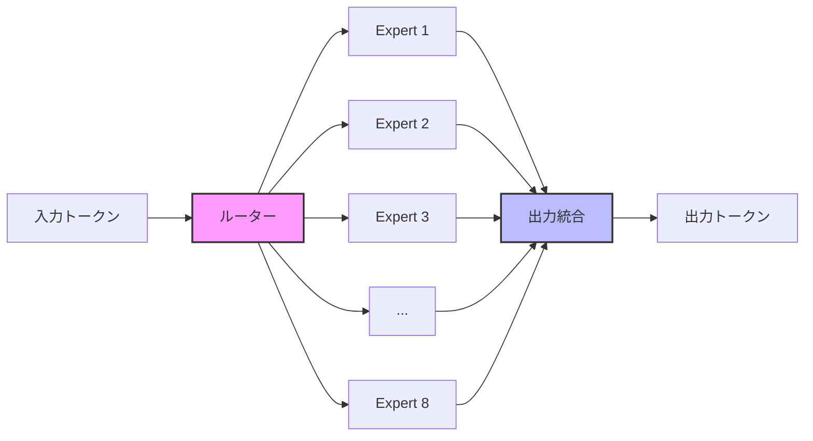
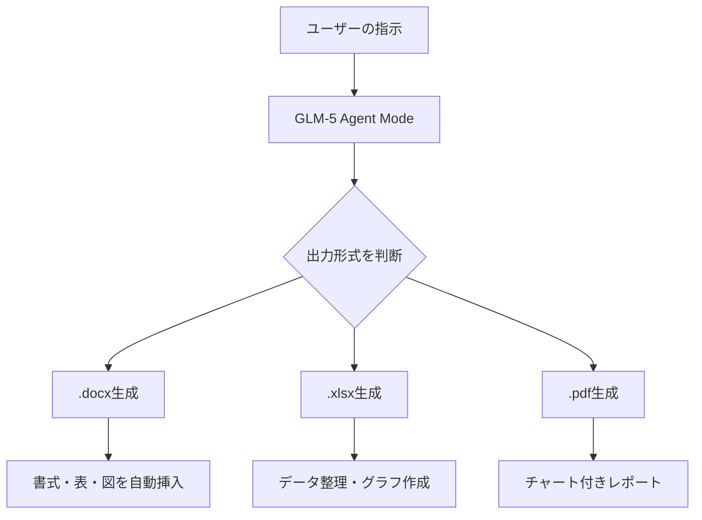

## 📌 3行でわかるこの記事

- 🇨🇳 中国・智譜AI（Z.ai）が744Bパラメータの次世代モデル「GLM-5」を2026年2月11日にリリース
- 🏆 SWE-bench Verifiedで77.8%を達成し、オープンソースモデルとして世界最高水準の性能
- 📄 Word/PDF/Excelを自動生成する「Agent Mode」搭載、MITライセンスで完全無料公開

## はじめに

2026年2月11日、中国のAI企業**智譜AI（Z.ai）**が次世代大規模言語モデル**GLM-5**を発表しました。744Bパラメータという巨大なMixture-of-Experts（MoE）アーキテクチャを採用し、コーディング・推論・エージェント能力においてClaude Opus 4.5に迫る性能を実現しています。

MITライセンスでのオープンソース公開という点でも注目を集めており、本記事ではその技術的詳細と実力を解説します。


*(出典: [zai-org/GLM-5 GitHub](https://github.com/zai-org/GLM-5))*

## GLM-5の基本スペック

| 項目 | GLM-4.5 | GLM-5 |
|------|---------|-------|
| 総パラメータ数 | 355B | 744B |
| アクティブパラメータ | 32B | 40B |
| エキスパート数 | - | 256（同時8基稼働） |
| スパース率 | - | 5.9% |
| コンテキスト長 | 128K | 200K |
| 事前学習データ | 23Tトークン | 28.5Tトークン |
| ライセンス | Apache 2.0 | MIT |

### アーキテクチャの特徴

GLM-5はMixture-of-Experts（MoE）構造を採用しています。256個のエキスパートのうち、1トークンあたり8個のみが活性化される仕組みです。これにより744Bの総パラメータを持ちながら、推論時のアクティブパラメータは40Bに抑えられ、効率的な推論が可能です。



> 256個のエキスパートからトークンごとに最適な8個を選択して処理

さらに、DeepSeekが開発した**Dynamically Sparse Attention（DSA）**を統合し、最大200Kトークンの長文脈を効率的に処理します。

## 訓練基盤：Huawei Ascendチップで完全独立

GLM-5の最も注目すべき点の一つは、**Huawei Ascendチップ**とMindSporeフレームワークのみで訓練されたことです。米国製GPU（NVIDIA A100/H100）に依存せず、中国国内のハードウェアのみで最先端モデルの訓練を実現しました。

### 「slime」：新しい非同期強化学習基盤

大規模モデルの強化学習（RL）訓練は、従来、スケーラビリティが課題でした。智譜AIは**「slime」**と呼ばれる新しい非同期RLインフラを開発し、以下を実現しています：

- トレーニングスループットの大幅改善
- より細粒度のポストトレーニングの反復
- 事前学習と事後学習の両面での効率化

## ベンチマーク性能

### コーディング能力

GLM-5はコーディングベンチマークにおいて、オープンソースモデルとして世界最高水準を達成しています。

| ベンチマーク | GLM-5 | Claude Opus 4.5 | Gemini 3.0 Pro | GPT-5.2 |
|-------------|-------|------------------|----------------|---------|
| SWE-bench Verified | **77.8** | 80.9 | 73.2 | 80.0 |
| Terminal Bench 2.0 | **56.2** | 58.1 | - | - |
| CC-Bench-V2 | 高スコア | 最高水準 | - | - |

SWE-bench Verifiedの77.8%は、Claude Opus 4.5（80.9%）に迫る数値であり、オープンソースモデルとしては最高スコアです。


*(出典: [zai-org/GLM-5 GitHub](https://github.com/zai-org/GLM-5))*

### ハルシネーション抑制

GLM-5は**AA-Omniscience Index**でスコア-1を記録し、前世代から35ポイントの改善を達成しました。これは「知らないことは知らないと答える」能力が飛躍的に向上したことを意味し、AI業界全体でトップの信頼性です。

### エージェント能力

| ベンチマーク | 評価内容 | GLM-5の成績 |
|-------------|---------|------------|
| BrowseComp | ネット検索・情報理解 | OSS最高 |
| MCP-Atlas | ツール呼び出し・多段階タスク | OSS最高 |
| τ²-Bench | 複雑なマルチツールシナリオ | OSS最高 |
| Vending Bench 2 | 長期計画・意思決定 | $4,432（OSS最高） |

## Agent Mode：ドキュメント自動生成

GLM-5のネイティブ**Agent Mode**は、プロンプトやソース素材から直接オフィスドキュメントを生成できます。

- 📝 **Word文書**（.docx）：書式設定・表・図の挿入付き
- 📊 **Excel**（.xlsx）：データ整理・グラフ生成
- 📄 **PDF**：チャート付きレポート生成



智譜AIはこの機能を「**Vibe CodingからAgentic Engineeringへの転換**」と表現しています。

## 使い方

### API利用（OpenAI互換）

```python
import openai

client = openai.OpenAI(
    base_url="https://open.bigmodel.cn/api/paas/v4",
    api_key="YOUR_API_KEY"
)

response = client.chat.completions.create(
    model="glm-5",
    messages=[
        {"role": "user", "content": "Pythonでクイックソートを実装して"}
    ],
    max_tokens=4096
)

print(response.choices[0].message.content)
```

### OpenRouter経由

```python
import openai

client = openai.OpenAI(
    base_url="https://openrouter.ai/api/v1",
    api_key="YOUR_OPENROUTER_KEY"
)

response = client.chat.completions.create(
    model="zai/glm-5",
    messages=[
        {"role": "user", "content": "ReactでTodoアプリを作って"}
    ]
)
```

### セルフホスティング

Hugging Faceでウェイトが公開されています。

```bash
# Hugging Faceからダウンロード
huggingface-cli download zai-org/GLM-5

# vLLMで起動
python -m vllm.entrypoints.openai.api_server \
    --model zai-org/GLM-5 \
    --tensor-parallel-size 8
```

- **vLLM / SGLang** で動作
- FP8量子化版も提供

## 料金

| 項目 | 価格 |
|------|------|
| 入力トークン | $0.80〜1.00 / 百万トークン |
| 出力トークン | $2.56〜3.20 / 百万トークン |

OpenRouter経由またはchat.z.aiから利用可能です。

## 「Pony Alpha」の正体

2026年2月上旬、OpenRouterに突如現れた謎のモデル「**Pony Alpha**」がコーディング能力でClaude Opusに迫ると話題になりました。GitHubのPRやベンチマーク結果からGLM-5のステルスリリースではないかと推測され、智譜AIが後に公式に認めました。

## 智譜AIの躍進

智譜AIは2019年に清華大学のスピンオフとして設立され、2026年1月8日に香港証券取引所に上場しました。IPOで約5.58億ドル（約830億円）を調達し、**世界初の上場基盤モデル企業**となっています。

GLM-5の発表後、株価は最大34%急騰し、市場からの期待の高さを示しています。

## まとめ

GLM-5の特徴をまとめると：

- ✅ 744Bパラメータ（40Bアクティブ）のMoEアーキテクチャ
- ✅ SWE-bench Verified 77.8%でOSSモデル世界最高
- ✅ ハルシネーション率がAI業界トップの低さ
- ✅ Word/PDF/Excelを自動生成するAgent Mode
- ✅ Huawei Ascendチップのみで訓練（米国GPU非依存）
- ✅ MITライセンスで完全オープンソース

オープンソースでありながらClaude Opus 4.5に迫るコーディング能力を持つGLM-5は、自社環境でのデプロイやカスタマイズを検討している開発者にとって有力な選択肢です。特にAgent Modeによるドキュメント自動生成は、業務効率化に直結する実用的な機能と言えるでしょう。

## 参考リンク

- [GLM-5 公式GitHub](https://github.com/zai-org/GLM-5)
- [Hugging Face モデルカード](https://huggingface.co/zai-org/GLM-5)
- [智譜AI公式サイト](https://www.zhipuai.cn/en)
- [GIGAZINE - GLM-5解説記事](https://gigazine.net/gsc_news/en/20260212-z-ai-glm-5/)
- [VentureBeat - GLM-5のslime技術](https://venturebeat.com/technology/z-ais-open-source-glm-5-achieves-record-low-hallucination-rate-and-leverages)
